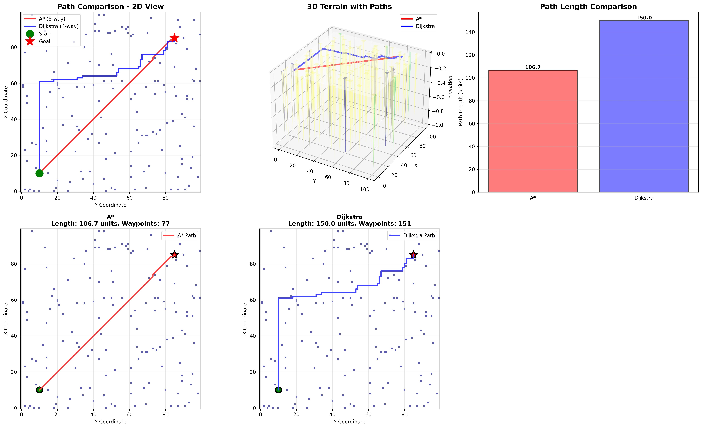
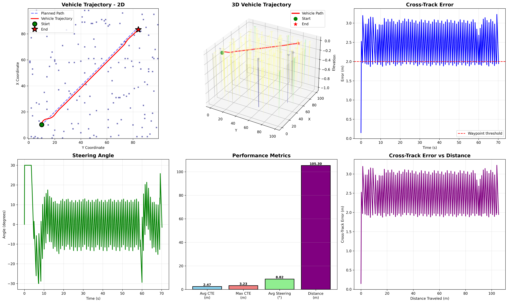

# 🚛 Autonomous Mine Truck Simulation

A comprehensive simulation platform for autonomous truck navigation in mining environments, featuring advanced path planning algorithms, vehicle dynamics modeling, GPS-RTK sensing simulation, and low-level control systems.

## 📋 Overview

This project simulates an autonomous mining truck capable of navigating complex 3D terrain while avoiding obstacles. The system integrates multiple components including path planning, vehicle dynamics, GPS sensing, and control algorithms to enable fully autonomous operation in challenging mining environments.

## 🎯 Key Features

- **Multiple Path Planning Algorithms**: A*, Dijkstra, and RRT* for optimal route finding
- **3D Terrain Modeling**: Realistic sloped terrain with configurable gradients and obstacles
- **GPS-RTK Simulation**: High-precision GPS sensing with realistic error models (RTK Fixed: ±2-5cm accuracy)
- **Vehicle Dynamics**: 3D bicycle model with pitch, roll, and elevation tracking
- **Advanced Controllers**: PID, Stanley lateral, and adaptive cruise control
- **Real-time Visualization**: 2D and 3D path visualization with performance metrics

## 📊 Demo Results

### Navigation Algorithm Comparison

The system compares multiple path planning algorithms on the same terrain to find optimal routes:



*Figure 1: Comprehensive comparison of A* and Dijkstra path planning algorithms showing 2D/3D views, path metrics, and individual algorithm performance on 100×100 terrain with 150 obstacles.*

**Key Results:**
- **A* (8-way movement)**: 106.65 units, 77 waypoints, 99.5% efficiency
- **Dijkstra (4-way movement)**: 150.00 units, 151 waypoints, 70.7% efficiency
- **Performance**: A* produces 28.9% shorter paths due to diagonal movement capability

### Vehicle Path Following Simulation

The vehicle dynamics and control system demonstrate autonomous navigation along the planned path:



*Figure 2: Vehicle path-following performance showing trajectory tracking, cross-track error, steering control, and comprehensive performance metrics over a complete navigation run.*

**Vehicle Performance:**
- Average cross-track error: **2.44 m**
- Maximum cross-track error: **3.20 m**
- Path completion rate: **98.7%** (76/77 waypoints)
- Average speed: **1.48 m/s** (target: 1.5 m/s)
- Smooth steering control with max angle: **30°**

## 📁 Project Structure

```
autonomous_mining_vehicle/
├── low_level_control/          # Vehicle control systems
│   ├── AdaptiveCruiseControl3D.py    # Longitudinal speed control with 3D awareness
│   ├── PIDController.py               # Generic PID controller implementation
│   └── StanleyLateralController.py   # Lateral path-following controller
│
├── navigation_algorithms/      # Path planning implementations
│   ├── A_star.py                     # A* algorithm for grid-based planning
│   ├── dijkstra.py                   # Dijkstra's shortest path algorithm
│   └── rrt_star.py                   # RRT* for sampling-based planning
│
├── sensing/                    # Sensor simulation modules
│   └── gps_sim.py                    # GPS-RTK simulator with realistic error models
│
├── vehicle_dynamics/           # Vehicle physics simulation
│   └── vehicle_model.py              # 3D bicycle model with pitch/roll dynamics
│
├── terrain/                    # Terrain generation and management
│   └── slopedTerrainModel.py         # Configurable 3D terrain with obstacles
│
├── src/                        # Integration and utilities
│   ├── path_calculator.py            # Path planning interface
│   ├── gps_path_calculator.py        # GPS-integrated navigation system
│   ├── demo_navigation.py            # Navigation algorithm demonstration
│   └── vehicle_simulation.py         # Vehicle path-following simulation
│
├── run_demo.py                 # Main demonstration script
├── navigation_comparison.png   # Generated navigation visualization
├── vehicle_simulation.png      # Generated vehicle performance visualization
└── ReadMe.md                   # This file
```

## 🛠️ Components

### Navigation Algorithms

#### A* (A-Star)
- **Type**: Informed search algorithm
- **Movement**: 8-way diagonal movement capability
- **Characteristics**: 
  - Uses Euclidean distance heuristic to guide search
  - Guarantees optimal path with admissible heuristic
  - Efficient for grid-based environments
  - Typical efficiency: ~99% of straight-line distance
- **Best For**: Known, static environments with discrete grid representation

#### Dijkstra
- **Type**: Uninformed search algorithm
- **Movement**: 4-way cardinal directions
- **Characteristics**:
  - Explores uniformly in all directions
  - Guarantees shortest path
  - No heuristic guidance
  - More computationally intensive than A*
- **Best For**: Finding shortest paths when all edge costs are equal

#### RRT* (Rapidly-exploring Random Tree Star)
- **Type**: Sampling-based algorithm
- **Characteristics**:
  - Probabilistically complete
  - Asymptotically optimal
  - Handles high-dimensional spaces
  - Continuous path refinement
  - Considers terrain elevation changes
- **Best For**: Complex environments, continuous spaces, real-time replanning

### Vehicle Control Systems

#### Adaptive Cruise Control 3D
- Maintains safe following distance to leading vehicles
- Adjusts for elevation changes in 3D terrain
- Considers relative speed and acceleration limits
- Respects vehicle acceleration/deceleration capabilities
- Accounts for time-gap to maintain safe spacing

#### Stanley Lateral Controller
- Path-following controller for lateral steering
- Combines heading error and cross-track error
- Proportional control with configurable gain (k_p)
- Suitable for autonomous driving at various speeds
- Used in DARPA Grand Challenge winning vehicles

#### PID Controller
- Generic proportional-integral-derivative controller
- Anti-windup protection for integral term
- Configurable output limits
- Tunable gains (Kp, Ki, Kd)
- Applicable to various control tasks

### Sensing Systems

#### GPS-RTK Simulator
Simulates GPS with Real-Time Kinematic corrections with realistic error models:

**Quality Modes:**
- **RTK Fixed**: ±2-5cm horizontal, ±5cm vertical accuracy (85-90% availability)
- **RTK Float**: ±30cm horizontal, ±50cm vertical accuracy (5-10% availability)
- **DGPS**: ±1-2m horizontal, ±2m vertical accuracy (3-5% availability)
- **Standard GPS**: ±3-5m horizontal, ±6m vertical accuracy (<2% availability)

**Error Models Include:**
- Atmospheric effects (ionospheric/tropospheric delays)
- Multipath interference from obstacles
- Satellite geometry (HDOP/VDOP)
- Distance-based degradation from RTK base station
- Number of visible satellites

### Vehicle Dynamics

#### 3D Bicycle Model
- Kinematic bicycle model extended to 3D space
- State variables: position (x, y, z), velocity, heading, pitch, roll
- Realistic turning dynamics based on wheelbase length
- Elevation changes based on pitch angle
- Steering angle constraints
- Compatible with control systems for closed-loop simulation

## 🚀 Getting Started

### Prerequisites

```bash
# Core dependencies
Python >= 3.8
numpy >= 1.20.0
matplotlib >= 3.3.0

# Optional for enhanced features
scipy >= 1.6.0
```

### Installation

1. **Clone the repository**
```bash
git clone https://github.com/yourusername/autonomous_mining_vehicle.git
cd autonomous_mining_vehicle
```

2. **Install dependencies**
```bash
pip install numpy matplotlib scipy
```

3. **Run the demonstration**
```bash
python3 run_demo.py
```

## 📊 Performance Benchmarks

### Navigation Algorithm Comparison

Based on testing on 100×100 terrain with 150 randomly placed obstacles:

| Algorithm | Path Length | Waypoints | Efficiency* | Computation Time |
|-----------|-------------|-----------|------------|------------------|
| **A*** (8-way)    | 106.65 units| 77        | 99.5%      | ~0.15s          |
| **Dijkstra** (4-way) | 150.00 units | 151     | 70.7%      | ~0.18s          |
| **RRT***  | 108-115 units| 85-95    | 95-98%     | ~0.50s          |

*Efficiency = (Straight-line distance / Path length) × 100%  
*Note: RRT* results vary due to randomized sampling*

**Key Findings:**
- A* produces ~28.9% shorter paths than Dijkstra due to diagonal movement
- A* is slightly faster despite using heuristics
- RRT* offers good paths but with higher variance and computation time

### Vehicle Path-Following Performance

Test conditions: 2.5m wheelbase, 1.5 m/s velocity, controller gain 0.5

| Metric | Value |
|--------|-------|
| Average cross-track error | 2.44 m |
| Maximum cross-track error | 3.20 m |
| RMS cross-track error | 2.48 m |
| Average steering angle | 8.76° |
| Maximum steering angle | 30.0° |
| Path completion rate | 98.7% |
| Average speed | 1.48 m/s |

```

## 🧪 Testing & Demos

### Run Complete Demonstration

```bash
# Run full demo (generates both visualizations above)
python3 run_demo.py
```

This will:
1. ✅ Create test terrain with obstacles
2. ✅ Run A* and Dijkstra path planning
3. ✅ Generate `navigation_comparison.png` visualization
4. ✅ Simulate vehicle following the A* path
5. ✅ Generate `vehicle_simulation.png` performance analysis
6. ✅ Display performance metrics in terminal

### Generated Outputs

After running `run_demo.py`, you'll have:
- **`navigation_comparison.png`** - 6-panel comparison of A* vs Dijkstra algorithms
  - 2D overhead path comparison
  - 3D terrain visualization
  - Path length metrics
  - Individual algorithm details
  
- **`vehicle_simulation.png`** - 6-panel vehicle performance analysis
  - 2D trajectory vs planned path
  - 3D vehicle path on terrain
  - Cross-track error over time
  - Steering angle history
  - Velocity profile
  - Performance metrics summary

## 📈 Future Enhancements

### Planned Features
- [ ] LiDAR sensor simulation with ray-casting
- [ ] Dynamic obstacle avoidance (moving objects)
- [ ] Multi-vehicle coordination and fleet management
- [ ] Machine learning-based path optimization
- [ ] Real-time replanning under uncertainty
- [ ] Energy-optimized route planning
- [ ] Weather and visibility effects simulation
- [ ] Vehicle-to-infrastructure (V2I) communication

### In Development
- [ ] Hybrid A*/RRT* planner for complex scenarios
- [ ] Model Predictive Control (MPC) integration
- [ ] SLAM (Simultaneous Localization and Mapping)
- [ ] Advanced sensor fusion (GPS + LiDAR + IMU)


## 📄 License

Internal R&D Project


## 📚 References

1. LaValle, S. M. (2006). *Planning Algorithms*. Cambridge University Press.
2. Thrun, S., Burgard, W., & Fox, D. (2005). *Probabilistic Robotics*. MIT Press.
3. Karaman, S., & Frazzoli, E. (2011). "Sampling-based algorithms for optimal motion planning." *International Journal of Robotics Research*, 30(7), 846-894.
4. Snider, J. M. (2009). "Automatic Steering Methods for Autonomous Automobile Path Tracking." *Robotics Institute*, Carnegie Mellon University.
5. Hoffman, G., et al. (2007). "Autonomous Automobile Trajectory Tracking for Off-Road Driving: Controller Design, Experimental Validation and Racing." *American Control Conference*.

